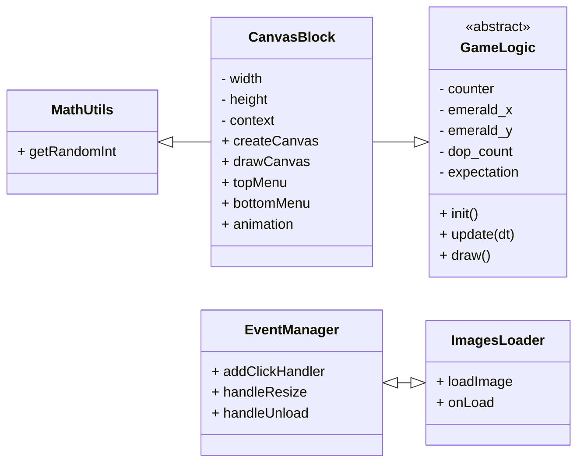

# Содержание

- [UML-диаграмма общих взаимосвязей](#uml-диаграмма-общих-взаимосвязей)
- [Базовые классы](#базовые-классы)
  - [HamsterPage](#hamsterpage)
  - [HamsterController](#hamstercontroller)
- [Модель](#модель)

# UML-диаграмма общих взаимосвязей

# Базовые классы

## HamsterPage

Компонент отвечает за отрисовку страницы игры и создание HTML-канваса для игрового процесса Hamster Combat.
Он использует React hooks для управления состоянием размеров канваса и реагирует на изменения окна браузера. Создает экземпляр класса HumsterController и останавливает анимацию при переходе на другую страницу.

## HamsterController

Компонент отвечает за реакцию игры на действие пользователя, а именно за клик по экрану. Увеличивает количество монет заработанных играком, в зависимости от стоимости клика. Расчитывает попадание игрока по изумрудам и добавляет бонусные монеты.
Определяет модель, необходимую для отрисовки игры и меняет ее значение.

## HamsterView

Компонент отвечает за отрисовку элементов игры внутри HTML-канва.

### Основные функции:

Анимация и отрисовка элементов игрового интерфейса, включая круговой меню, счетчик и изображение хомяка.
Управление жизненным циклом анимации с помощью requestAnimationFrame.
Рендеринг различных элементов игрового интерфейса, таких как счетчик, изображение доллара и уровень пользователя.

### Ключевые методы:

|        Имя         | Описание                                        |
| :----------------: | :---------------------------------------------- |
|  **drawCanvas()**  | Отрисовывает основной игровой интерфейс.        |
|   **topMenu()**    | Рисует верхнюю часть меню.                      |
|  **bottomMenu()**  | Рисует нижнюю часть меню.                       |
|  **animation()**   | Управляет анимационным циклом игры.             |
|    **redraw()**    | Обновляет позицию объекта Emerald.              |

## Модель:

- width и height: Размеры канваса.
- counter: Счетчик кликов пользователя за данный раунд.
- emerald_y и emerald_x: Позиция объекта Emerald.
- expectation: Временное значение ожидания появления объекта Emerald.
- dop_count: Количество оставшихся попыток.
- per: Количество монет, зарабатываемых за один клик пользователя.
- per_hour: Количество монет, зарабатываемых пользователем за один час.
- current_level: Уровень пользователя в игре.
- current_meaning: Количество заработанных монет в предыдущих раундах.
- transitional_meaning: Количество монет необходимых для перехода на следующий уровень.
