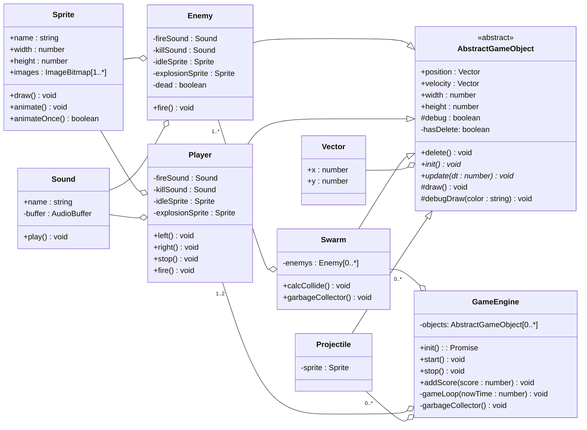

# Содержание

- [UML-диаграмма общих взаимосвязей](#uml-диаграмма-общих-взаимосвязей)
- [Базовые классы](#базовые-классы)
  - [GameEngine](#gameengine)
  - [AbstractGameObject](#abstractgameobject)
  - [Расчёт столкновений](#расчёт-столкновений)
  - [Sound](#sound)
  - [Sprite](#sprite)
  - [Vector](#vector)
- [Классы игровых объектов](#классы-игровых-объектов)
  - [Player](#player)

# UML-диаграмма общих взаимосвязей

```classDiagram
    class GameEngine {
        - canvas: HTMLCanvasElement
        - context: CanvasRenderingContext2D
        - width: number
        - height: number
        - counter: number
        - animationFrameId: number | null
        - emerald_y: number
        - emerald_x: number
        - expectation: number
        - dop_count: number
        
        + componentDidMount()
        + componentWillUnmount()
        + createCanvas()
        + drawCanvas()
        + topMenu()
        + bottomMenu()
        + drawCircle()
        + drawDolar()
        + animation()
        + redraw()
        + onClick(e: MouseEvent)
    }

    class HumsterPage extends GameEngine {
        + render()
    }

    class Vector {
        - x: number
        - y: number
        
        + add(other: Vector): Vector
        + subtract(other: Vector): Vector
    }

    class Image {
        - width: number
        - height: number
        - src: string
        
        + onload(callback: () => void)
    }

    GameEngine --> Vector
    GameEngine --> Image
```

# Базовые классы

## GameEngine

Отвечает за общий цикл игры и управление объектами и звуками.

## AbstractGameObject

Абстрактный класс, представляющий общий функционал для всех игровых объектов (позиция, движение, отрисовка).

## Расчёт столкновений

Модуль, отвечающий за вычисление столкновений между объектами.

## Sound

Класс для работы со звуками.

## Sprite

Класс для работы со спрайтами.

## Vector

Класс, представляющий математический вектор для работы с позициями и скоростями.

# Классы игровых объектов

## Player
Хомяк, которого нужно тапать и развивать.


