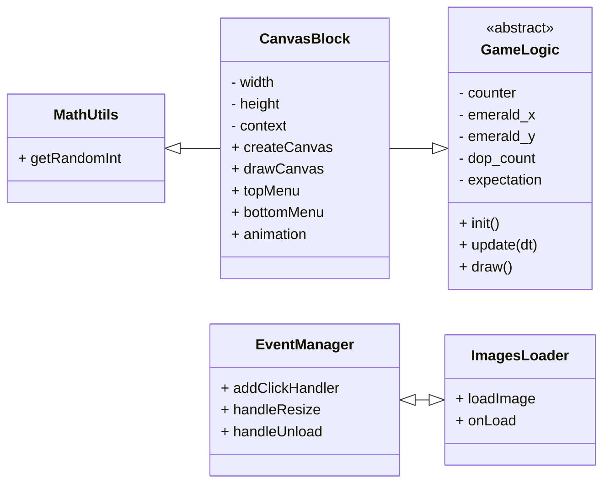

# Содержание

- [UML-диаграмма общих взаимосвязей](#uml-диаграмма-общих-взаимосвязей)
- [Базовые классы](#базовые-классы)
  - [GameLogic](#gamelogic)
  - [CanvasBlock](#acanvasblock)
- [Классы игровых объектов](#классы-игровых-объектов)
  - [Player](#player)

# UML-диаграмма общих взаимосвязей

# Базовые классы

## GameLogic

Отвечает за общий цикл игры и управление объектами и звуками.

## CanvasBlock

Компонент CanvasBlock отвечает за создание и управление HTML-канвасом для игрового процесса Hamster Combat. Он использует React hooks для управления состоянием размеров канваса и реагирует на изменения окна браузера. Этот компонент является ключевым элементом в реализации игрового процесса Hamster Combat, обеспечивая взаимодействие пользователя с игрой и отображение всех необходимых элементов интерфейса.

### Основные функции:

Создание и настройка HTML-канваса с использованием DOM API.
Обработка событий клика мыши для взаимодействия пользователя с игровым процессом.
Анимация и отрисовка элементов игрового интерфейса, включая круговой меню, счетчик и изображение хомяка.
Управление жизненным циклом анимации с помощью requestAnimationFrame.
Рендеринг различных элементов игрового интерфейса, таких как счетчик, изображение доллара и кнопка Boost.

### Ключевые методы:

|        Имя         | Описание                                        |
| :----------------: | :---------------------------------------------- |
| **createCanvas()** | Инициализирует канвас и контекст для рисования. |
|  **drawCanvas()**  | Отрисовывает основной игровой интерфейс.        |
|   **topMenu()**    | Рисует верхнюю часть меню.                      |
|  **bottomMenu()**  | Рисует нижнюю часть меню.                       |
|  **animation()**   | Управляет анимационным циклом игры.             |
|    **redraw()**    | Обновляет позицию объекта Emerald.              |

### Состояние компонента:

width и height: Размеры канваса.
counter: Счетчик кликов пользователя.
emerald_y и emerald_x: Позиция объекта Emerald.
expectation: Временное значение ожидания появления объекта Emerald.
dop_count: Количество оставшихся попыток.

# Классы игровых объектов

## Player

Хомяк, которого нужно тапать и развивать.
