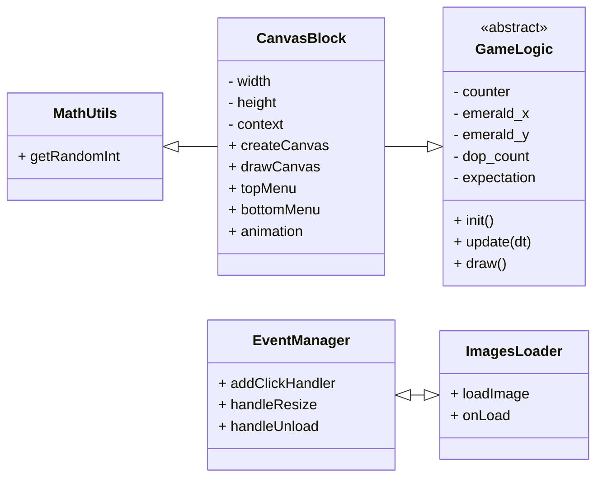

# Содержание

- [UML-диаграмма общих взаимосвязей](#uml-диаграмма-общих-взаимосвязей)
- [Базовые классы](#базовые-классы)
  - [GameLogic](#gameengine)
  - [CanvasBlock](#abstractgameobject)
- [Классы игровых объектов](#классы-игровых-объектов)
  - [Player](#player)

# UML-диаграмма общих взаимосвязей

# Базовые классы

## GameLogic

Отвечает за общий цикл игры и управление объектами и звуками.

## Player

Хомяк, которого нужно тапать и развивать.
