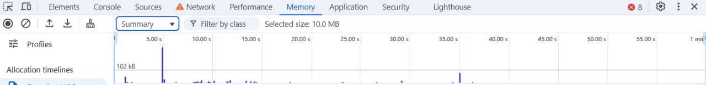
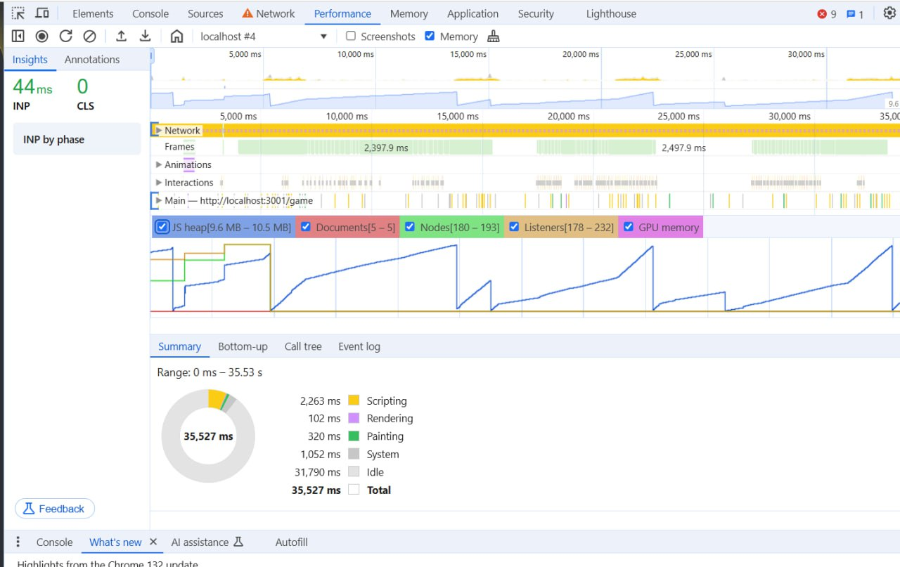

# Поиск утечек памяти

Провека на утечки памяти производилась через DevTools браузера Chrome. 
А именно через вкладки Memory и Performance.

## Вкладка Memory

**Select JavaScript VM instance**
При запуске приложения до начала игры - **9.4МВ**

Во время игры занимаемая память увеличивается незначительно и колеблится в диапазоне - **10МВ - 10.6МВ**

По завершению раунда память освобождается практически до первоначального значения - **9.9МВ**
Отличие от количества занимаемой памяти до первого запуска (раунда) обусловлено сохранением данных о заработанных монетах
после прохождения раунда. При прохождении нескольких раундов подряд количество занимаемой памяти по завершению игры не меняется.

**Timeline**
На графике ниже показано использование памяти во время игры (от экрана старт до экрана завершения).
Где 1й скачек - отрисовка экрана начала игрыж;
 далее самый большой пик - начало игры, отрисовка конвас и анимации;
 множество мелких столбиков - обработка кликов;
 предпоследний пик, аналдогичный по затратам первому - отрисовка экрана завершения игры.

 Из графика хорошо видно, что между обработкой событий и отрисовкой страниц память не затрачивается.

## Вкладка Performance
В приведенных данных указано что во время игры JS heap составляет **9.6МВ - 10.5МВ**,
 что сопоставимо с данными при ручном наблюдении.
 Так же на графике отчетлево видно, как память уменьшается при сборке мусора.
